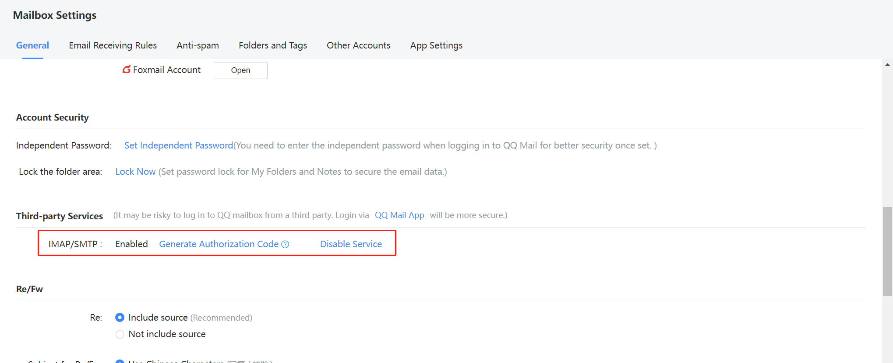
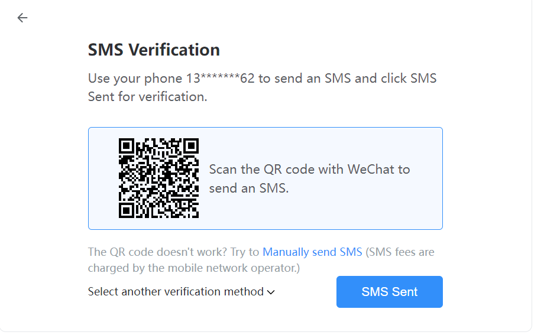
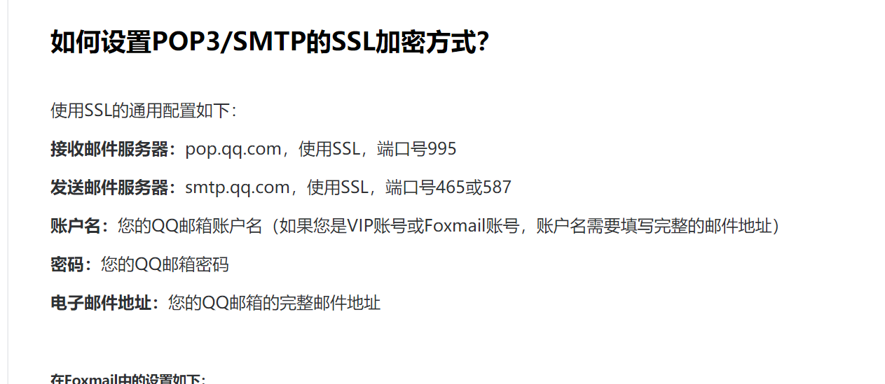
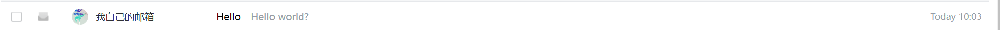
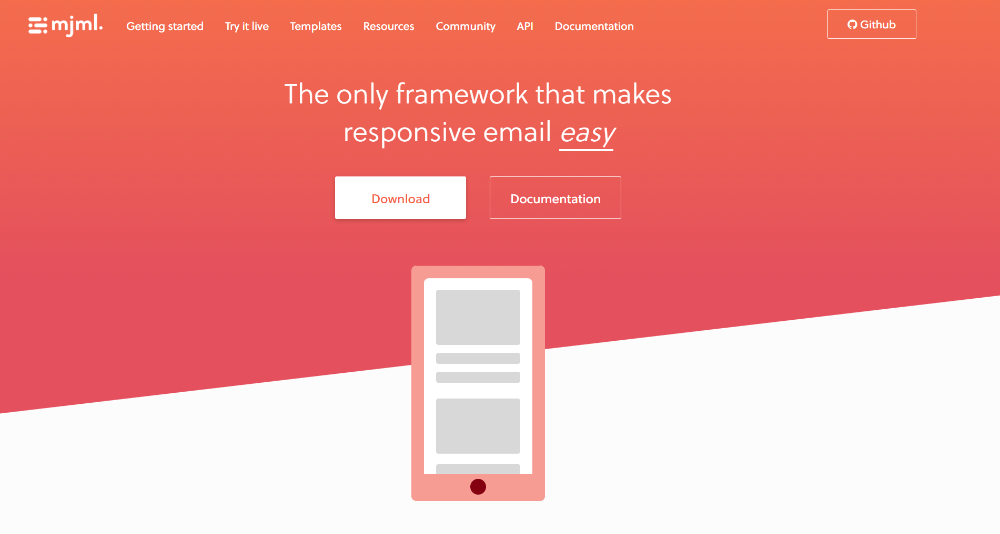
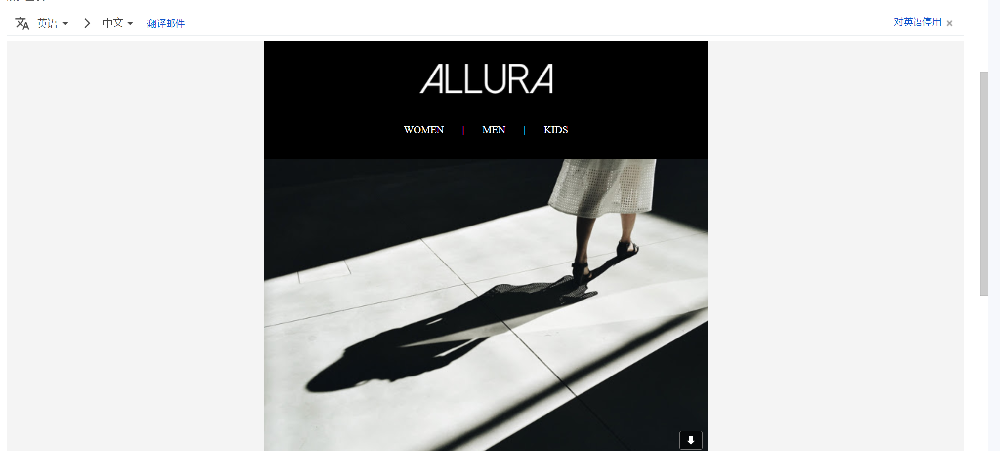

# NodeJs 发送邮件

在很多场景我们需要给用户发送邮件，比如用户注册，忘记密码，消息通知等

今天看下怎么用 Node 搭建一个邮件服务，这里使用的是 QQ 邮箱，Node 的依赖用的是 nodemailer。

Nodemailer 的主要特点包括：

1. 简单易用：Nodemailer 提供了简单的 API，使得发送电子邮件变得容易。
2. 支持多种传输方式：Nodemailer 支持 SMTP、Sendmail、Amazon SES 等多种传输方式，可以根据需要选择适合的方式。
3. 强大的功能：Nodemailer 支持发送 HTML 内容、附件、嵌入式图片等功能，可以满足各种邮件发送需求。
4. 可靠性：Nodemailer 具有良好的稳定性和可靠性，被广泛用于生产环境。
5. 社区支持：Nodemailer 拥有活跃的开发者社区，可以获取到丰富的文档和支持。

## 前期准备

## QQ 邮箱设置

1. 在 QQ 邮箱设置页面需要允许 IMAP/SMTP
   

2. 获取权限码，点击 Generate Authorization Code，发送邮件后就可以获取到一个验证码了。授权码是 QQ 邮箱用于登录第三方客户端的专用密码。
   

3. 查看邮箱的服务端口
   

## 代码

```js
const nodemailer = require("nodemailer");

const transporter = nodemailer.createTransport({
  host: "smtp.qq.com",
  port: 587,
  secure: false,
  auth: {
    user: "xx@qq.com", // 你的qq邮箱
    pass: "auth code", // 上一步骤中获取的验证码
  },
});

async function main() {
  const info = await transporter.sendMail({
    from: '"xx@qq.com"', // 你的qq邮箱
    to: "yy@gmail.com", // 目标邮箱地址
    subject: "Hello", // 邮箱标题
    text: "Hello world?", // 邮箱内容
  });
}

main().catch(console.error);
```

执行上面的代码，便可以看到我们的邮箱收到一封邮件了。


## 邮件模板

因为 node 写的邮件支持 html，所以我们可以配置邮件模板生成一些好看的邮件。

这里推荐使用 mjml


## 安装

```bash
npm install mjml
```

安装之后，选择一个模板打开 https://mjml.io/try-it-live/templates/black-friday

```HTML
<mjml>
  <mj-body background-color="#F4F4F4" color="#55575d" font-family="Arial, sans-serif">
    <mj-section background-color="#000000" background-repeat="no-repeat" text-align="center" vertical-align="top">
      <mj-column>
        <mj-image align="center" border="none" padding-bottom="30px" padding="10px 25px" src="http://5vph.mj.am/img/5vph/b/1g86w/0g67t.png" target="_blank" title="" width="180px"></mj-image>
        <mj-text align="left" color="#55575d" font-family="Arial, sans-serif" font-size="13px" line-height="22px" padding-bottom="0px" padding-top="0px" padding="10px 25px">
          <p style="line-height: 18px; margin: 10px 0; text-align: center;font-size:14px;color:#ffffff;font-family:'Times New Roman',Helvetica,Arial,sans-serif">WOMEN&nbsp; &nbsp; &nbsp; &nbsp;| &nbsp; &nbsp; &nbsp; MEN&nbsp; &nbsp; &nbsp; &nbsp;| &nbsp; &nbsp; &nbsp; KIDS</p>
        </mj-text>
      </mj-column>
    </mj-section>
    <mj-section background-color="#000000" background-repeat="no-repeat" text-align="center" vertical-align="top" padding="0 0 0 0">
      <mj-column>
        <mj-image align="center" border="none" padding-bottom="0px" padding-left="0px" padding-right="0px" padding="0px 25px" src="http://5vph.mj.am/img/5vph/b/1g86w/0696u.jpeg" target="_blank" title="" width="780px"></mj-image>
      </mj-column>
    </mj-section>
    <mj-section background-color="#000000" background-repeat="no-repeat" text-align="center" vertical-align="top" padding="0 0 0 0">
      <mj-column>
        <mj-text align="left" color="#55575d" font-family="Arial, sans-serif" font-size="13px" line-height="22px" padding-bottom="5px" padding-top="25px" padding="10px 25px">
          <p style="line-height: 60px; text-align: center; margin: 10px 0;font-size:55px;color:#fcfcfc;font-family:'Times New Roman',Helvetica,Arial,sans-serif"><b>Black Friday</b></p>
        </mj-text>
        <mj-text align="left" color="#55575d" font-family="Arial, sans-serif" font-size="13px" line-height="22px" padding-bottom="20px" padding-top="0px" padding="10px 25px">
          <p style="line-height: 30px; text-align: center; margin: 10px 0;color:#f5f5f5;font-size:25px;font-family:'Times New Roman',Helvetica,Arial,sans-serif"><b>Take an&nbsp; extra 50% off</b><br /><span style="color:#ffffff;font-size:18px;font-family:'Times New Roman',Helvetica,Arial,sans-serif">Use code SALEONSALE* at checkout</span></p>
        </mj-text>
      </mj-column>
    </mj-section>
    <mj-section background-color="#000000" background-repeat="no-repeat" text-align="center" vertical-align="top" padding-bottom="40px" padding="0 0 0 0">
      <mj-column>
        <mj-button background-color="#ffffff" border-radius="3px" font-family="Times New Roman, Helvetica, Arial, sans-serif" font-size="18px" font-weight="normal" inner-padding="10px 25px" padding-bottom="30px" padding="10px 25px"><span style="color:#212020">Shop Now</span></mj-button>
        <mj-text align="left" color="#55575d" font-family="Arial, sans-serif" font-size="13px" line-height="22px" padding-bottom="0px" padding-top="5px" padding="10px 25px">
          <p style="line-height: 16px; text-align: center; margin: 10px 0;font-size:12px;color:#ffffff;font-family:'Times New Roman',Helvetica,Arial,sans-serif">* Offer valid on Allura purchases on 17/29/11 at 11:59 pm. No price adjustments on previous&nbsp;<br /><span style="color:#ffffff;font-family:'Times New Roman',Helvetica,Arial,sans-serif">purchases, offer limited to stock. Cannot be combined with any offer or promotion other than free.</span></p>
        </mj-text>
      </mj-column>
    </mj-section>
  </mj-body>
</mjml>
```

将上面的代码粘贴到 `test.mjml` 文件，然后执行 `<./node_modules/.bin/mjml  -r ./template/test.mjml -o ./output.html>` 便可以将上面的`mhml`文件转换成`output.html`文件

然后将上面的发送邮件的代码改为读取 html 文件

```js
async function main() {
  const info = await transporter.sendMail({
    from: '"xx@qq.com"',
    to: "yy@gmail.com",
    subject: "Hello",
    // text: "Hello world?",
    html: fs.readFileSync("./output.html"),
  });
}
```

执行上面的代码便可以在邮件中收到如下的模板内容

