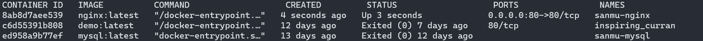

# Docker 的基本使用

## 拉取镜像

```bash
$ docker pull [选项] [Docker Registry 地址[:端口号]/]仓库名[:标签]
```

例子

```bash
docker pull nginx:latest
docker pull nginx:1.25
```

## 常用命令
### 启动容器
通过pull 的命令，我们已经下载了nginx的镜像，接下来我们需要将这个镜像跑动起来。
```bash
docker run [OPTIONS] IMAGE [COMMAND] [ARG...]
```
启动服务
```bash
docker run nginx
```
#### options
- **-a stdin:** 指定标准输入输出内容类型，可选 STDIN/STDOUT/STDERR 三项；
- **-d:**   后台运行容器，并返回容器ID；
- **-i:** 以交互模式运行容器，通常与 -t 同时使用；
- **-P:** 随机端口映射，容器内部端口**随机**映射到主机的端口
- **-p:** 指定端口映射，格式为：主机(宿主)端口:容器端口
- **-t:** 为容器重新分配一个伪输入终端，通常与 -i 同时使用；
- **--name="nginx-lb":** 为容器指定一个名称；
- **--dns 8.8.8.8:** 指定容器使用的DNS服务器，默认和宿主一致；
- **--dns-search example.com:** 指定容器DNS搜索域名，默认和宿主一致；
- **-h "mars":** 指定容器的hostname；
- **-e username="ritchie":** 设置环境变量；
- **--env-file=[]:** 从指定文件读入环境变量；
- **--cpuset="0-2" or --cpuset="0,1,2":** 绑定容器到指定CPU运行；
- **-m :**设置容器使用内存最大值；
- **--net="bridge":** 指定容器的网络连接类型，支持 bridge/host/none/container: 四种类型；
- **--link=[]:** 添加链接到另一个容器；
- **--expose=[]:** 开放一个端口或一组端口；
- **--volume , -v:** 绑定一个卷，`宿主机目录`:`容器目录`

启动一个最新版本的`nginx`服务，将容器内的`/etc/nginx/conf`文件夹映射到机器目录`/d/nginx`上
```bash
docker run --name sanmu-nginx -p 80:80 -v /d/nginx:/etc/nginx/conf -d nginx:latest
```
查看挂载卷，后面的`sanmu-nginx`就是上面`--name`创建的名字
```bash
docker inspect sanmu-nginx
```
通过上面的命令启动后，我们可以访问 `localhost`
![[assets/5.png]]

### 查看所有的容器
```bash
docker ps -a
```


### 停止容器
通过上面的命令，可以找到`sanmu-nginx`的`container id`，我们可以使用这个`id`来停止我们的容器
```bash
docker stop ed958a9b77ef
```
### 启动容器
```bash
docker start
```

