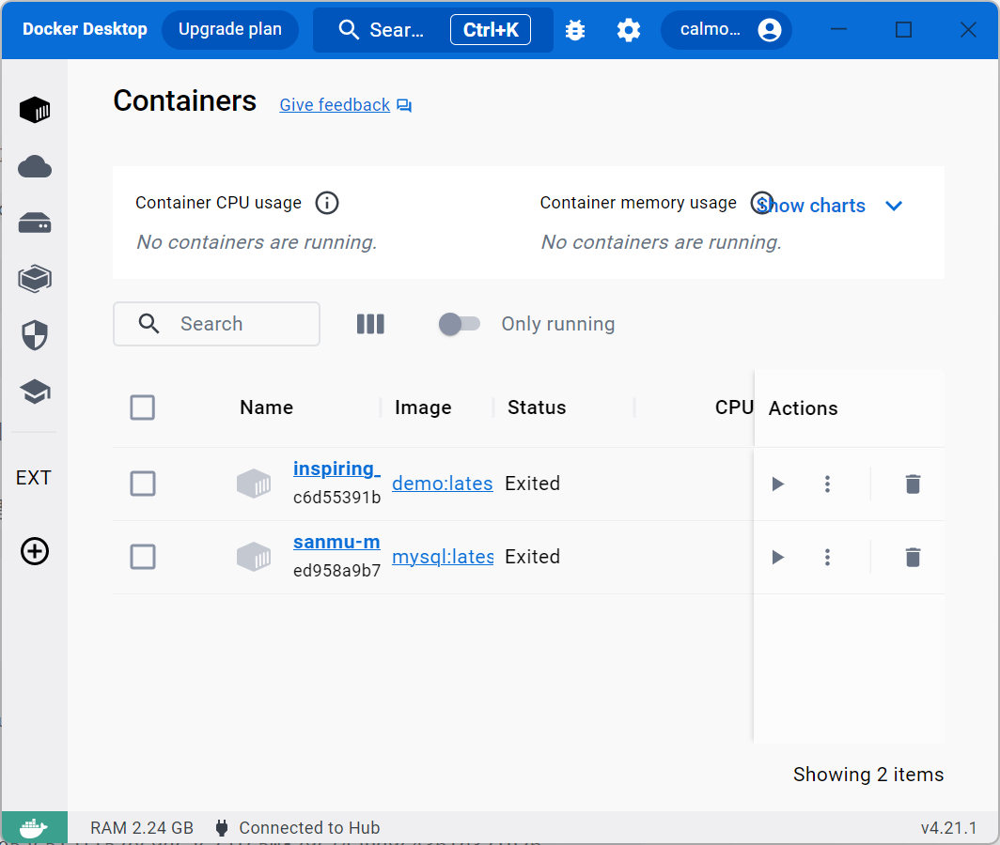

# 安装

### windows 或者 mac

windows 和 mac 可以直接安装软件，访问 https://www.docker.com/ 。
软件安装后，直接执行软件就可以在终端使用 docker 命令了，也可以通过直接操作软件实现 docker 的各种操作。



### linux 可以通过 apt 安装

通过 apt 进行安装

```
$ sudo apt-get update

$ sudo apt-get install docker-ce docker-ce-cli containerd.io
```

也可以使用脚本自动安装

```
$ curl -fsSL get.docker.com -o get-docker.sh
$ sudo sh get-docker.sh --mirror Aliyun
```

#### 启动 docker

```
$ sudo systemctl enable docker
$ sudo systemctl start docker
```
