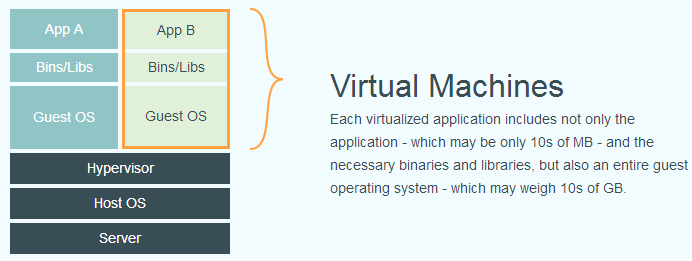

# docker 介绍

## 什么是 docker

Docker 是一个开源的容器化平台，用于构建、打包和运行应用程序的轻量级容器。它能够将应用程序及其依赖项打包到一个称为 Docker 容器的独立运行环境中，从而实现应用程序的快速部署和可移植性。

Docker 的主要优势在于它的轻量级和灵活性。与传统的虚拟化技术相比，Docker 容器不需要额外的操作系统来运行应用程序，因为它们共享宿主操作系统的内核。这使得容器非常快速和高效，并且可以在任何支持 Docker 的操作系统上运行。

通过使用 Docker，开发人员可以轻松地创建、分发和运行应用程序，无论是在开发、测试还是生产环境中。多个容器可以同时运行在单个宿主机上，每个容器互相隔离，从而保证应用程序的安全性和稳定性。

Docker 还提供了一个强大的容器管理工具，可以自动化地构建、部署和扩展应用程序。它还支持与其他工具和平台的集成，如 Kubernetes 等，从而方便了容器集群的管理和调度。

总的来说，Docker 是一个流行的容器化技术，能够简化应用程序的开发、部署和管理过程，提高开发效率和应用程序的可移植性。

## docker 和虚拟机的区别

Docker 和虚拟机是两种不同的技术，它们在实现应用程序的隔离和部署上有一些区别。

1. 架构差异：虚拟机通过在物理主机上运行一个完整的操作系统来实现隔离，每个虚拟机都有自己的内核和系统资源。而 Docker 使用共享的宿主操作系统的内核，在其上运行独立的容器。

2. 资源利用率：由于虚拟机需要运行完整的操作系统，因此它们相对较重，需要更多的内存和计算资源。而 Docker 容器是轻量级的，共享宿主操作系统的资源，因此可以更高效地利用系统资源。

3. 启动时间：虚拟机启动时间较长，需要启动整个操作系统和相关服务。相比之下，Docker 容器的启动时间非常短，通常在几秒钟内。

4. 可移植性：Docker 容器可以在任何支持 Docker 的操作系统上运行，而虚拟机则需要特定的虚拟化技术和相应的操作系统来运行。

5. 环境隔离：虚拟机提供了更加强大的隔离能力，每个虚拟机都有自己独立的操作系统和文件系统。而 Docker 容器共享宿主操作系统的内核和文件系统，提供了较轻量级的隔离。

总的来说，虚拟机适用于需要完全隔离、运行不同操作系统的场景，它们更重量级但提供了更强大的隔离和独立性。而 Docker 适用于轻量级的应用程序隔离和部署，具有更快的启动时间、更高的资源利用率和更好的可移植性。

> **所以，Docker 容器里面的服务必须兼容宿主机的系统。**

#### 通过下图可以直观感受两者的区别

传统虚拟化

Docker

## 基本概念

### 镜像-Image

Docker 镜像是 Docker 容器的基础构建块。它是一个只读的模板，包含了运行容器所需的所有文件系统、代码、运行时环境、库和依赖项等。可以将 Docker 镜像视为容器的静态快照，可以用来创建和运行多个相同配置的容器实例。

每个 Docker 镜像都有一个唯一的标识符，称为镜像 ID。镜像 ID 由 SHA-256 算法生成，用于标识镜像的内容和版本。镜像还可以被标记和命名为易于识别的方式，比如标签（`Tag`）。

Docker 镜像使用层次化文件系统结构，由多个只读的文件系统层组成。每个层都包含了文件系统中的一部分变化，从基础镜像开始，每个层都可以添加、修改或删除文件。这种层次化结构使得镜像在构建和部署过程中可以共享和重用已有的层，从而提供了高度的效率和快速启动时间。

通过使用 Docker 镜像，可以实现快速、可靠和可移植的应用程序部署。镜像提供了一个一致和独立的运行环境，使得应用程序在不同的开发、测试和生产环境中具有可移植性和可重复性。

### 容器-Container
镜像是静态的，容器是镜像运行时的实体。容器可以被创建、启动、停止、删除、暂停等。

容器的实质是进程，有自己的命名空间。容器内的进程是运行在一个隔离的环境离，使用起来，就像独立于宿主的系统下操作一样。

### 仓库
镜像可以存在本地，但是很多时候我们需要分享镜像，以便别人使用或者下载别人的镜像。

一个 **Docker Registry** 中可以包含多个 **仓库**（`Repository`）；每个仓库可以包含多个 **标签**（`Tag`

我们通过`<仓库名>：<标签>` 的格式指定镜像是哪个软件哪个版本。如果没有写标签，则默认 `latest`作为默认标签

如 `unbutu:16.04` 表示安装 `unbutu` 的16.04 版本，如果只写 `unbutu` 则安装 `unbutu:latest` 。

