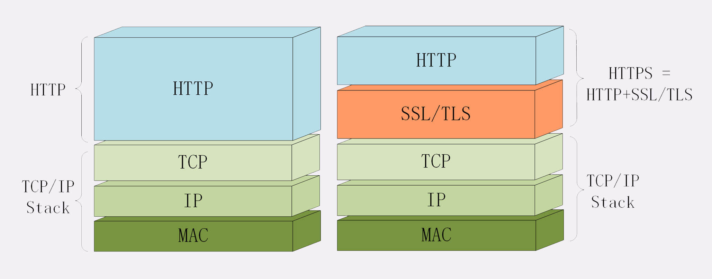

# HTTPS 介绍

## 什么是 HTTPS

HTTP 的端口是 80，HTTPS 的端口是 443。其他方面，如应答模式、报文结构、请求方法、URI、头字段等都是沿用的 HTTP。

HTTPS 的 S 指的是 SSL/TLS，让 HTTP 运行在了安全的 SSL/TLS 协议上。

## TLS

安全套接层（Secure Sockets Layer），位于 OSI 模型第五层（会话层）。

TLS 由记录协议、握手协议、警告协议、密码变更规范协议、扩展协议等几个子协议组成，综合使用了对称加密、非对称加密、身份认证等技术。

在使用 TLS 建立浏览器和服务器之间的连接时，需要选择一组前置加密算法来进行通信，这些算法称为“密码套件”。

TLS 的密码套件基本形式为：密钥交换算法 + 签名算法 + 对称加密算法 + 摘要算法。

## 常见概念

- 加密：将某个消息通过某种方式转化成一堆乱码。
- 解密：将某个加密后的乱码解析为可读的内容。
- 密钥：加密和解密的操作都需要使用密钥。

## 对称加密

加密和解密使用的密钥都是同一个，是对称的。

### 对称加密算法

AES：密钥长度 128、192 或 256，是最广泛的对称加密算法

ChaCha20：密钥长度固定 256 位

加密和解密使用的密钥都是同一个，是对称的。

### 对称加密算法

目前最广泛使用的对称加密算法是 AES，其密钥长度可以是 128、192 或 256 位。

还有一种对称加密算法是 ChaCha20，其密钥长度固定为 256 位。

## 非对称加密

对称加密的一个主要问题在于密钥交换。如何将密钥传递给对方，如果被别人拦截了密钥，那么加密的意义就不存在了。

为了解决这个问题，出现了公钥和私钥的概念。

公钥加密后只能使用私钥解密，反之亦然。网站保存私钥并发布公钥，用户在想要登录网站时，通过使用公钥进行加密，网站可以通过使用私钥进行解密。由于其他人没有私钥，因此无法破解。

### 非对称加密算法

RSA：使用两个超大的素数的乘积作为生成密钥的材料。

ECC：基于椭圆曲线离散对数的数学难题，使用特定的曲线方程和基点生成公钥和私钥。

## 混合加密

由于非对称加密算法性能较差，因此 TLS 使用了混合加密。

1、通过非对称加密解决密钥交换问题。

2、使用随机数产生对称算法使用的会话密钥，然后使用公钥进行加密。

3、接收方使用私钥解密密文，取出会话密钥。

4、完成密钥交换后，之后都使用对称加密。

## 摘要算法

将任意长度的数据压缩成固定长度且独一无二的“摘要”字符串。转换后的“摘要”字符串无法逆推出原文。常见的摘要算法包括 MD5（16 字节）、SHA-1（20 字节）和 SHA-2（28 字节、32 字节、48 字节）。

## 完整性

将原文和摘要发送到服务器上，服务器获取信息后，计算摘要并进行对比。如果一致，则代表信息完整。

因为相同的信息必定会生成相同的摘要；若信息改变，则摘要也会改变。

摘要算法不具备机密性，因此传输消息和摘要时需要加密。

## 数字签名

通过上述操作，信息已经得到了安全保障。但是仍然存在两个端口的漏洞，即黑客可以伪装成服务器或客户端来模拟与您的通信，让您误以为是正确的人。

数字签名通过使用 **私钥加密摘要** 来实现，加密摘要是因为摘要长度小，性能耗费少。

简单来说，就是证明你是你，我现在正在通信的对方是你，而不是别人。

对私钥加密后的摘要，对方通过公钥解密获得的摘要内容和通过摘要算法从原文计算出的摘要应该是一样的，这样就同时实现了身份认证和不可否认。

## 数字证书和 CA

然而，还存在一个问题，即公钥的信任。由于任何人都可以发布公钥，因此我们需要确认该公钥是由你发布的，而不是黑客发布的。

因此，我们需要通过证书机构（CA）为每个公钥签名，以证明该公钥是可信的。CA 对公钥的签名认证包含序列号、用途、颁发者、有效时间等格式，将这些信息打包后再进行签名，最终形成数字证书。

小 CA 让大 CA 签名认证，最终链接到根证书，形成自签名证书或根证书。浏览器和操作系统内置了各大 CA 的根证书，因此只要服务发来的证书通过验证证书里的签名，就可以沿着证书链一层层地验证，找到根证书，从而证明传输过来的公钥是可信的。

## 总结

1、对称加密，存在密钥交换的问题

2、非对称加密，基于复杂的数学难题，运行速度较慢。

3、混合加密，如何保证完整性？不被修改？

4、摘要算法，无法保证是用户自己。

5、数字签名，如何保证公钥安全且正确？

6、数字证书、CA

## 参考

本篇文章是《透视 HTTP 协议》的笔记

[https://time.geekbang.org/column/article/108643](https://time.geekbang.org/column/article/108643)
