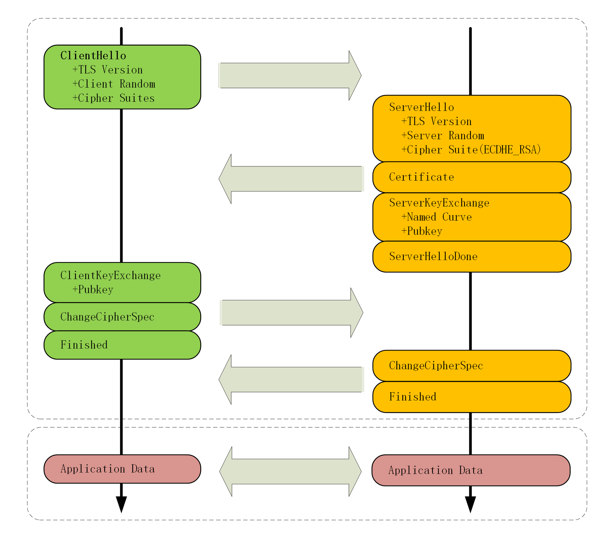

# TLS 过程

## TLS 协议组成

- 记录协议：规定 TLS 收发数据的基本单位。
- 警报协议：向对方发出警报信息。
- 握手协议：浏览器和服务器在握手过程中协商 TLS 版本号、随机数、密码套件等信息，然后交换证书和密钥参数，最终双方协商得到的会话密钥，用于后续的混合加密系统。
- 变更密码规范协议：通知对方，后续的数据使用加密保护。

## TLS 过程

### 步骤 1：客户端发送协议版本号和加密算法列表

TLS 过程开始时，客户向服务器发送一个 ClientHello 消息。该消息包含使用的 TLS 协议版本号和加密算法列表、还有一个随机数（Client Random）。服务器将从中选择一种加密算法以及最高版本的 TLS 协议来进行下一步通信。

### 步骤 2：服务器发送数字证书

服务器在接收到 ClientHello 消息后，会回复一个 ServerHello 消息，该消息包含服务器选择的加密算法和 TLS 协议版本号，也给出一个随机数（Server Random）。接着，服务器会发送数字证书给客户端。数字证书包括服务器的公钥、服务器信息和数字签名等信息，用于验证服务器的身份和确保通信安全。

### 步骤 3：客户端验证数字证书

客户端会验证服务器发送的数字证书。首先，客户端会检查数字证书是否是受信任的证书颁发机构所颁发的。接着，客户端会验证数字证书是否过期或被吊销，并且验证数字签名是否有效。如果数字证书通过验证，客户端则会使用服务器的公钥进行加密。

### 步骤 4：双方协商生成对称密钥

客户端使用服务器的公钥对数据进行加密后，会将加密后的数据发送给服务器。服务器接收到数据后，使用自己的私钥进行解密。接着，服务器和客户端会协商生成对称密钥，用于后续通信的加密和解密。

### 步骤 5：客户端发送加密后的数据

客户端和服务器通过之前生成的对称密钥进行后续通信的加密和解密。客户端会将加密后的数据发送给服务器，服务器接收到数据后，使用对称密钥进行解密。

### 步骤 6：TLS 过程结束

TLS 过程结束后，客户端和服务器之间建立了安全的通信连接，用于保护数据的保密性和完整性。

以上就是 TLS 过程的详细步骤。TLS 协议在网络安全中扮演着至关重要的角色，保障了数据的安全传输。

