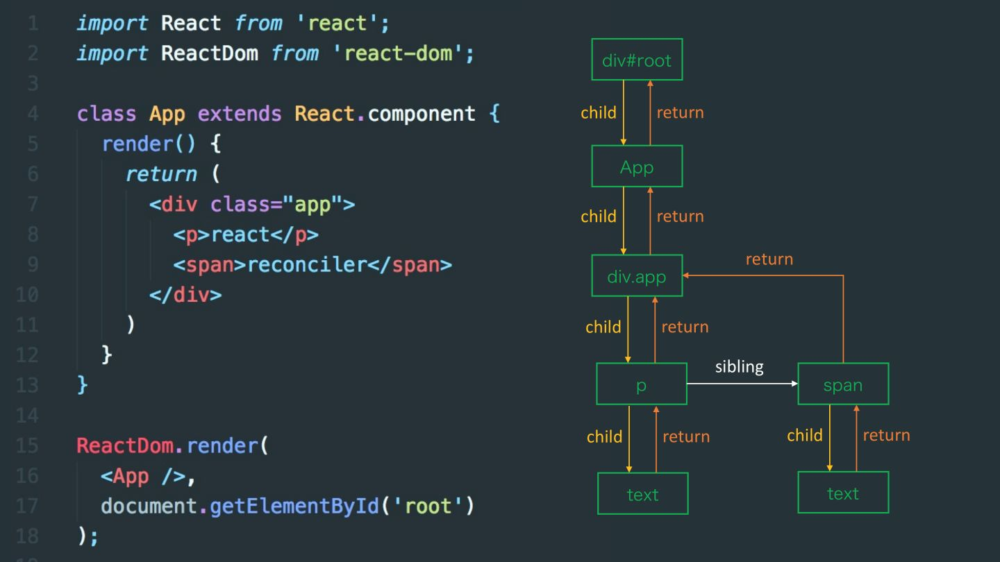

# Fiber

## Fiber 的前因后果

### Stack Reconciler

在 React 15.x 版本及以前，Reconciliation 算法使用栈调和器（ Stack Reconciler ）实现，但这个时期的栈调和器存在一些缺陷。

对于之前 JSX 方法执行后返回 ReactElement，因为它只记录自身的数据，如组件的类型、属性和子元素，但是不会记录与它相关的父节点，兄弟节点的关系。

导致 react 在调和的时候不能暂停渲染任务，也不能切分任务。

此外，它无法有效平衡组件更新渲染和动画相关任务的执行顺序，这也就意味着无法划分任务的优先级，可能导致重要任务的卡顿，以及动画掉帧等问题。因此，Stack Reconciler 的实现方式需要改进。

基于 Stack Reconciler 的页面效果


### Fiber Reconciler

在 React 16 版本中，引入了 Fiber 调和器（Fiber Reconciler）来替代栈调和器，从而推出了新的 Reconciliation 算法。Fiber Reconciler 利用调度器（Scheduler）来帮助处理组件的渲染/更新工作。此外，引入 Fiber 这个后，原来的 React Element Tree 有了一棵对应的 Fiber Node Tree。在 diff 两棵 React Element Tree 的差异时，Fiber Reconciler 基于 Fiber Node Tree 使用 diff 算法，通过 Fiber node 的 return、child、sibling 属性能够更方便地遍历 Fiber Node Tree，从而更高效地完成 diff 算法。

Fiber 的出现，可以最明显的两层含义：

1. 作为 element 元素，它保存该组件的类型和 dom 信息
2. 保存本次更新中该组件改变的状态、要执行的任务（需要插入/删除/更新等）

Fiber 调度的优点：

- 能够将可中断的任务切片处理；
- 能够调整任务优先级、重置并复用任务；
- 可以在父子组件任务间前进后退切换任务；
- render 方法可以返回多个元素（即可以返回数组）；
- 支持异常边界处理异常；

基于 Fiber Reconciler 的页面效果


通过上面两组动画能够比较出来，Fiber 的动画比 Stack 的动画要顺滑很多。

----


## element，Fiber、Dom 三者的关系

- element 是开发者写的 jsx 语法，写的是元素结构，保存了 props，children 等内容
- dom 是元素在浏览器上用户直观可以看到的内容
- fiber 是 element 和 dom 之间的连接桥，每一个 element 对应一个 fiber 对象

在 React 中，我们通过 JSX 写入以下的代码

```jsx
<div className="sanmu" sex="male">
  <p>三木</p>
</div>
```

经过 babel 转义，会变成以下的方法，将一个 html 的结构编程一个方法函数，其中 div 的属性，都变成\_jsx 方法的一个 key-value

```jsx
import { jsx as _jsx } from 'react/jsx-runtime';
/*#__PURE__*/ _jsx('div', {
  className: 'sanmu',
  sex: 'male',
  children: /*#__PURE__*/ _jsx('p', {
    children: '\u4E09\u6728',
  }),
});
```

通过上面的方法在转成 fiber 对象，多个 fiber 对象构成了一课 fiber 树，fiber 树是构成 DOM 树的数据模型，fiber 树的任何改动，最终都体现在 DOM 树中。

换句话说：

开发人员通过编写`JSX`代码来形成`Fiber`，之后`Fiber`来构建`DOM`。


## element 与 fiber 之间的对应关系

通过这个对应关系，当遇到不同的类型时，可以创建不同结构的 fiber 对象。

展示一些常见的类型：

|                            | element                             |
| -------------------------- | ----------------------------------- |
| FunctionComponent = 0      | 函数组件                            |
| ClassComponent = 1         | 类组件                              |
| IndeterminateComponent = 2 | 初始化不知道是函数组件还是类组件    |
| HostRoot = 3               |                                     |
| HostPortal = 4             | ReactDOM.createPortal 产生的 Portal |
| HostComponent = 5          | dom 元素，如 div，span              |
| HostText = 6               | 文本节点                            |
| Fragment = 7               | React.Fragment                      |
| Mode = 8                   | React.StrictMode                    |
| ContextConsumer = 9        | Context.Consumer                    |
| ContextProvider = 10       | Context.Provider                    |
| ForwardRef = 11            | React.ForwardRef                    |
| …                          |                                     |

---

## Fiber 是什么

fiber 既是一个数据结构，也是一个执行单元。

### 一、数据结构

#### 1、Fiber 保存的信息

fiber 有很多属性，大体分为以下 5 种：

- 结构信息，用于表示节点在树中的位置。
- 节点类型信息，tag 表示节点的分类，type 保存具体类型值，例如 div，mycomp。
- 节点状态，节点的组件实例，props，state 等。
- 副作用 effectTag，通过 nextEffect 连接。
- 替身，React 会构建一颗新的树——workInProgress Tree，通过 alternate 指向旧树的相同节点。

```jsx
export type Fiber = {
  /**
  *  作为静态数据结构的属性
  */
  tag: WorkTag,   // fiber类型，例如函数组件、类、Ref等等
  key: null | string, // 子节点的唯一标识，用于调和子节点使用
  elementType: any,  // 节点元素类型，是具体的类组件、函数组件等，elmentType 与 element 中的type一样
  type: any, fiber节点的类型，如span，div
  /** 指向真实的dom元素
   * 1. 若当前fiber节点是dom元素，则对应的是真实DOM元素；
   * 2. 若当前是function component，则值为null；
   * 3. 若当前是class component，则值为class初始化出来的实例；
   * 4. 若当前是 host component，即树的根节点，stateNode为 FiberRootNode；
   */
  stateNode: any,  // 节点实例(状态),若不存在走创建，存在走更新


  /**
  *  作为静态数据结构的属性
  */
  return: Fiber | null, // 指向父级fiber
  child: Fiber | null, // 指向子级fiber
  sibling: Fiber | null,// 指向兄弟fiber
  index: number, // 索引
  ref:
    | null
    | (((handle: mixed) => void) & {_stringRef: ?string, ...})
    | RefObject,

  /**
  *  作为动态的工作单元的属性
  */
  pendingProps: any, // 在一次更新中，代表element创建
  memoizedProps: any, // 记录上一次更新完毕后的props
  updateQueue: mixed, // 类组件存放setState更新队列，函数组件存放
  memoizedState: any // 类组件保存state信息，函数组件保存hooks信息，dom元素为null
  dependencies: Dependencies | null, // context或者时间的依赖项

  mode: TypeOfMode, // fiber树的模式，比如ConcurrentMode

  nextEffect: Fiber | null, // 串联下一个副作用的fiber节点
  firstEffect: Fiber | null, // 副作用的第一个节点
  lastEffect: Fiber | null, // 副作用的最后一个节点

  // 副作用
  flags: Flags,  // 节点更新的优先级
  subtreeFlags: Flags, // 子节点的更新情况
  deletions: Fiber[], // 子节点需要删除的节点

  // 调度优先级相关
  lanes: Lanes,
  childLanes: Lanes,

  alternate: Fiber | null, // 双缓存树，指向缓存fiber。用于更新阶段，两棵树相互交替
};
```

##### tag

fiber 中的 tag 类型是 workType，用于标记不同的 react 类型

```jsx
export const FunctionComponent = 0;
export const ClassComponent = 1;
export const IndeterminateComponent = 2;
export const HostRoot = 3;
export const HostPortal = 4;
export const HostComponent = 5;
export const HostText = 6;
export const Fragment = 7;
export const Mode = 8;
export const ContextConsumer = 9;
export const ContextProvider = 10;
export const ForwardRef = 11;
export const Profiler = 12;
export const SuspenseComponent = 13;
export const MemoComponent = 14;
export const SimpleMemoComponent = 15;
...
```

##### key 和 type

key 和 type 用于 react diff 过程中判断 fiber 是否可以复用。

key 为用户定义的唯一值。

type 定义与此 fiber 关联的功能或者类。对于组件，它指向函数或者类本身；对于 DOM 元素，它指向 HTML Tag。

#### stateNode

记录当前 fiber 对应的真实 dom 节点或者当前虚拟组件的实例，方便真实dom的追踪和 Ref。


#### 2、Fiber 节点与 Fiber 节点之间的联系

每个 Fiber 记录了它上面的信息，而且 Fiber 与 Fiber 之间也会相互关联。



每个 Fiber 通过 child、sibling、return 三个属性建立连接。

- `child` 指子 Fiber 节点
- `sibling` 指兄弟 Fiber 节点
- `return` 指父 Fiber 节点

### 二、执行单元

Fiber 可以被理解为一个执行单元。每次执行完一个执行单元，React 就会检查现在是否还有多少时间，如果没有时间就将控制权让出去。

1. 首先 React 向浏览器请求调度。
2. 若浏览器在一帧时间内有空闲时间，则去判断是否有可疑执行的任务。
   1. 如果存在，则执行它。若执行完成后还有时间，继续执行下一个。
   2. 如果不存在，则将控制权交给浏览器。

----

## 几个概念

###  workInProgress

正在内存中构建的 fiber 树称为`WorkInProgress Fiber`树。在一次更新中，通过定义一个`workInProgress`变量来指向下一个工作单元。更新之后，`workInProgress`树上的状态是最新的状态，它将变成`current`树用于渲染视图。

### current

正在视图渲染的树，也就是当前页面上 dom 所对应的那个节点树。

### 副作用
节点的增删改，比如修改了 state、props 等数据，除了数据变化之外，还会造成 dom的变化，这种在 render阶段不能完成的工作，称之为副作用。在`Reconciliation`过程中发现的“副作用”保存在`fiber`的`effectTag`中，在本次渲染的所有包含副节点的 fiber 通过它们的`nextEffect`连接起来。

## Fiber 的执行阶段

从根节点开始渲染和调度的过程可以分为两个阶段：`render`阶段和`commit`阶段。

- `render`阶段：可以中断，会找出所有节点的变更。
- `commit`阶段：不可以中断，会执行所有的变更。

### render 阶段

在这个阶段，我们要找出所有节点的变更，如节点新增、删除、属性变更等等。这些变更被统称为副作用（`effect`），vdom 变为 fiber 的过程称之为“`reconcile`”。在这个阶段中，我们会构建一棵 `Fiber Tree` 并通过连接这些变更产生一个 `effect list`。

在`workLoop`中，通过`performUnitOfWork`函数返回下一个工作单元。

```jsx
文件地址：/packages/react-reconciler/src/ReactFiberWorkLoop.old.js
function workLoopConcurrent() {
  while (workInProgress !== null && !shouldYield()) {
    performUnitOfWork(workInProgress);
  }
}
```

在`performUnitOfWork`中，`workInProgress`会一直更新指向需要操作的`fiber`的节点，当`next=null`则表明没有下一个工作单元了。

在`beginWork`中，`next`始终查找当前 fiber 节点的`fiber.child`。如果`next`为`null`，则表示当前 fiber 没有子节点。然后进入`completeUnitOfWork`工作。在`completeUnitOfWork`中，会执行`completeWork`函数。

```jsx
function performUnitOfWork(unitOfWork: Fiber): void {
  let next;
  // 省略了一些判断代码
  next = beginWork(current, unitOfWork, renderLanes);

  if (next === null) {
    // 当找不到下一个工作单元后，就执行completeUnitOfWork的逻辑
    completeUnitOfWork(unitOfWork);
  } else {
    workInProgress = next;
  }
}
```

在`completeUnitOfWork`中会查询是否存在`sibling`，若不存在就直接回道`parent`了

```jsx
const siblingFiber = completedWork.sibling;
if (siblingFiber !== null) {
  // If there is more work to do in this returnFiber, do that next.
  workInProgress = siblingFiber;
  return;
}
// Otherwise, return to the parent
completedWork = returnFiber;
workInProgress = completedWork;
```

基于以上分析，可以说 fiber 的遍历过程是先找`child`，如果`child`不存在再找`sibling`，若`sibling`也没有了就返回到`parent`。

这是后序遍历。

在`beginWork`阶段，除了查找子节点之外，还会根据标签的不同创建不同的`Fiber`节点。这里的 switch 的类型就是用的我们上面表格的类型。

```jsx
// beginWork
// 根据tag执行不同的函数
switch (workInProgress.tag) {
  case IndeterminateComponent:
  case LazyComponent:
  case FunctionComponent:
  case ClassComponent:
  case HostRoot:
  case HostComponent:
  case HostText:
  case SuspenseComponent:
}
```

#### effect list

在 `commit` 节点时，需要找到所有带有 `effectTag` 的 `Fiber` 节点，并一次性执行 `effectTag` 的对应操作（创建、更新、删除）。

在 `completeUnitOfWork` 中，每个执行完 `completeWork` 且存在 `effectTag` 的 Fiber 节点都会保存在一条 `effectList` 的单项链表中。

`effectList` 中第一个 Fiber 节点保存在 `fiber.firstEffect`，最后一个节点保存在 `fiber.lastEffect`。

最终形成一条以 `rootFiber.firstEffect` 为起点的单项链表。

### commit 阶段

commit 阶段主要工作分为三个阶段：

- before mutation 阶段（执行 DOM 操作之前）
- mutation 阶段（执行 DOM 操作）
- layout 阶段（执行 DOM 操作后）

#### 遍历过程

将 jsx 转化为 fiber tree，每个节点有 child、sibling、return 属性，通过后序遍历 fiber tree。

## 任务执行过程

```jsx
// 保存当前的处理现场
let nextUnitOfWork: Fiber | undefined; // 保存下一个需要处理的工作单元
let topWork: Fiber | undefined; // 保存第一个工作单元

function workLoop(deadline: IdleDeadline) {
  // updateQueue中获取下一个或者恢复上一次中断的执行单元
  if (nextUnitOfWork == null) {
    nextUnitOfWork = topWork = getNextUnitOfWork();
  }

  // 🔴 每执行完一个执行单元，检查一次剩余时间
  // 如果被中断，下一次执行还是从 nextUnitOfWork 开始处理
  while (nextUnitOfWork && deadline.timeRemaining() > ENOUGH_TIME) {
    // 下文我们再看performUnitOfWork
    nextUnitOfWork = performUnitOfWork(nextUnitOfWork, topWork);
  }

  // 提交工作，下文会介绍
  if (pendingCommit) {
    commitAllWork(pendingCommit);
  }
}
```

## 参考文章

[https://www.xiabingbao.com/post/react/jsx-element-fiber-rfztfs.html](https://www.xiabingbao.com/post/react/jsx-element-fiber-rfztfs.html)

[https://juejin.cn/post/7212603037667786813](https://juejin.cn/post/7212603037667786813)

[https://juejin.cn/post/7202085514400038969](https://juejin.cn/post/7202085514400038969#heading-12)
