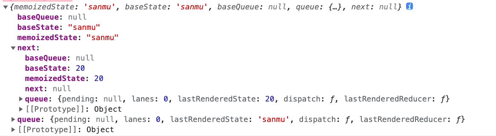

## Hooks 结构

### Hook

每个 hooks 方法都会生成一个类型为 Hook 的对象。

```jsx
// packages/react-reconciler/src/ReactFiberHooks.old.js
export type Hook = {|
  memoizedState: any, // 上次渲染时所用的 state
  baseState: any, // 已处理的 update 计算出的 state
  baseQueue: Update<any, any> | null, // 未处理的 update 队列（一般是上一轮渲染未完成的 update）
  queue: UpdateQueue<any, any> | null, // 当前出发的 update 队列
  next: Hook | null, // 指向下一个 hook，形成链表结构
|};
```

举个例子，下面是 hooks 转换后的结构：

```jsx
const [name, setName] = useState('sanmu');
const [num, setNum] = useState(20);
```



不同的 hooks 方法，memoizedState 存储的内容也不同：

- useState：state
- useEffect：effect 对象
- useMemo/useCallback：[callback, deps]
- useRef: {current: xxx}

### Update & UpdateQueue

```jsx
packages / react - reconciler / src / ReactFiberHooks.old.js;

export type Update<S, A> = {|
  lane: Lane, // 优先级
  action: A, // reducer对应要执行的action
  hasEagerState: boolean, //
  eagerState: S | null, // 触发 dispatch的state
  next: Update<S, A>, // 下一个要执行的update
|};

export type UpdateQueue<S, A> = {|
  pending: Update<S, A> | null, // 当前要触发的update
  lanes: Lanes, //
  dispatch: ((A) => mixed) | null, // 存放dispatchAction.bind()的值
  lastRenderedReducer: ((S, A) => S) | null, // 上一次render的reducer
  lastRenderedState: S | null, // 上一次render的state
|};
```

每次调用 setState 或 useReducer 的 dispatch 时，都会生成一个 Update 类型的对象，将其添加到 UpdateQueue 队列中

### Effect

Effect 结构是 useEffect 使用的

```jsx
// packages/react-reconciler/src/ReactFiberHooks.old.js
export type Effect = {|
  tag: HookFlags, // 标记是否有 effect 需要执行
  create: () => (() => void) | void, // 回调函数
  destroy: (() => void) | void, // 销毁时触发的回调
  deps: Array<mixed> | null, // 依赖的数组
  next: Effect, // 下一个要执行的 Effect
|};
```

## 执行过程

beginWork → updateFunctionComponent → renderWithHooks

```jsx
export function renderWithHooks<Props, SecondArg>(
  current: Fiber | null,
  workInProgress: Fiber,
  Component: (p: Props, arg: SecondArg) => any,
  props: Props,
  secondArg: SecondArg,
  nextRenderLanes: Lanes
): any {
  renderLanes = nextRenderLanes;
  // currentlyRenderingFiber 指向当前所执行的fiber
  currentlyRenderingFiber = workInProgress;

  // 置空 workInProgress fiber 中的memoizedState和updateQueue
  workInProgress.memoizedState = null;
  workInProgress.updateQueue = null;
  workInProgress.lanes = NoLanes;

  // 首次渲染 HooksDispatcherOnMount， 否则 HooksDispatcherOnUpdate
  ReactCurrentDispatcher.current =
    current === null || current.memoizedState === null
      ? HooksDispatcherOnMount
      : HooksDispatcherOnUpdate;
  // 执行函数组件的构造函数
  let children = Component(props, secondArg);

  // Check if there was a render phase update
  if (didScheduleRenderPhaseUpdateDuringThisPass) {
    // Keep rendering in a loop for as long as render phase updates continue to
    // be scheduled. Use a counter to prevent infinite loops.
    let numberOfReRenders: number = 0;
    do {
      didScheduleRenderPhaseUpdateDuringThisPass = false;
      localIdCounter = 0;

      if (numberOfReRenders >= RE_RENDER_LIMIT) {
        throw new Error(
          'Too many re-renders. React limits the number of renders to prevent ' +
            'an infinite loop.'
        );
      }

      numberOfReRenders += 1;
      if (__DEV__) {
        // Even when hot reloading, allow dependencies to stabilize
        // after first render to prevent infinite render phase updates.
        ignorePreviousDependencies = false;
      }

      // Start over from the beginning of the list
      currentHook = null;
      workInProgressHook = null;

      workInProgress.updateQueue = null;

      if (__DEV__) {
        // Also validate hook order for cascading updates.
        hookTypesUpdateIndexDev = -1;
      }

      ReactCurrentDispatcher.current = __DEV__
        ? HooksDispatcherOnRerenderInDEV
        : HooksDispatcherOnRerender;

      children = Component(props, secondArg);
    } while (didScheduleRenderPhaseUpdateDuringThisPass);
  }

  ReactCurrentDispatcher.current = ContextOnlyDispatcher;

  const didRenderTooFewHooks =
    currentHook !== null && currentHook.next !== null;

  //当前fiber任务结束，重置全局变量
  renderLanes = NoLanes;
  currentlyRenderingFiber = (null: any);

  currentHook = null;
  workInProgressHook = null;

  didScheduleRenderPhaseUpdate = false;

  return children;
}
```

在上述代码中，首先将 currentlyRenderingFiber 设置为 workInProgress。

接下来进行如下判断：

```jsx
ReactCurrentDispatcher.current =
  current === null || current.memoizedState === null
    ? HooksDispatcherOnMount
    : HooksDispatcherOnUpdate;
```

在 HooksDispatcherOnMount 中，存储了各种 mountHooks，最终会执行函数 mountWorkInProgressHook。

```jsx
const HooksDispatcherOnMount: Dispatcher = {
  readContext,

  useCallback: mountCallback,
  useContext: readContext,
  useEffect: mountEffect,
  useImperativeHandle: mountImperativeHandle,
  useLayoutEffect: mountLayoutEffect,
  useInsertionEffect: mountInsertionEffect,
  useMemo: mountMemo,
  useReducer: mountReducer,
  useRef: mountRef,
  useState: mountState,
  useDebugValue: mountDebugValue,
  useDeferredValue: mountDeferredValue,
  useTransition: mountTransition,
  useMutableSource: mountMutableSource,
  useSyncExternalStore: mountSyncExternalStore,
  useId: mountId,

  unstable_isNewReconciler: enableNewReconciler,
};
```

在 HooksDispatcherOnUpdate 中存储了各种 updateHooks，最终执行的函数为 updateWorkInProgressHook。

```jsx
const HooksDispatcherOnUpdate: Dispatcher = {
  readContext,

  useCallback: updateCallback,
  useContext: readContext,
  useEffect: updateEffect,
  useImperativeHandle: updateImperativeHandle,
  useInsertionEffect: updateInsertionEffect,
  useLayoutEffect: updateLayoutEffect,
  useMemo: updateMemo,
  useReducer: updateReducer,
  useRef: updateRef,
  useState: updateState,
  useDebugValue: updateDebugValue,
  useDeferredValue: updateDeferredValue,
  useTransition: updateTransition,
  useMutableSource: updateMutableSource,
  useSyncExternalStore: updateSyncExternalStore,
  useId: updateId,

  unstable_isNewReconciler: enableNewReconciler,
};
```

### mountWorkInProgressHook

通过 Hook 存储结构信息。在函数中，会创建一个 Hook，并将其挂载到 workInProgress fiber 的 memoizedState 指向的 hooks 链表上。

currentlyRenderingFiber.memoizedState 指向的第一个 hooks 节点

```jsx
// packages/react-reconciler/src/ReactFiberHooks.old.js
function mountWorkInProgressHook(): Hook {
  const hook: Hook = {
    memoizedState: null,

    baseState: null,
    baseQueue: null,
    queue: null,

    next: null,
  };
  // 串联成一个链表
  if (workInProgressHook === null) {
    // This is the first hook in the list
    currentlyRenderingFiber.memoizedState = workInProgressHook = hook;
  } else {
    // Append to the end of the list
    workInProgressHook = workInProgressHook.next = hook;
  }
  return workInProgressHook;
}
```

### updateWorkInProgressHook

在这个函数中会遍找寻 current 的 hook 节点和 workInProgress 的 hook 是节点。在 re-render 阶段，已经创建过 hooks 了，会复用已有的 workInProgress fiber 的 memoizedState


# 参考文章

[https://juejin.cn/post/7150506246771048478#heading-3](https://juejin.cn/post/7150506246771048478#heading-3)
