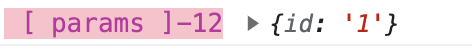
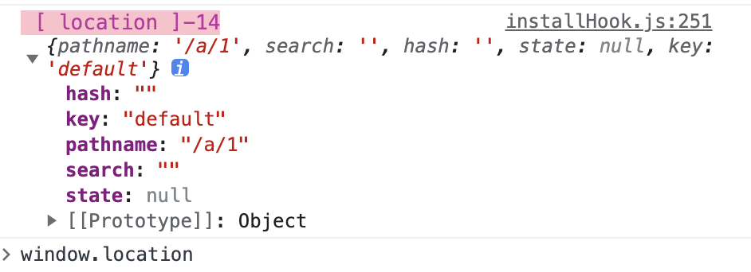
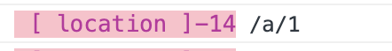

官网：https://reactrouter.com/en/main

## 安装

```bash
npm install react-router-dom
```

## 使用

`ReactRouter` 使用 `Router` 组件包裹根节点可以实现路由访问，比较常用的 Router 组建有两个分别是`BrowserRouter`和`HashRouter`。

### 1.BrowserRouter

`BrowserRouter` 将当前页面的路由地址存储在浏览器的内置历史记录堆栈中，通过如`/a/b`，`/a/c` 等 `url` 进行访问

```javascript
import { BrowserRouter } from 'react-router-dom';

function App() {
  return (
    <BrowserRouter>
      <div>content</div>
    </BrowserRouter>
  );
}

export default App;
```

### 2.HashRouter

```javascript
import { HashRouter } from 'react-router-dom';

function App() {
  return (
    <HashRouter>
      <div>content</div>
    </HashRouter>
  );
}

export default App;
```

### 3.Route

`Route` 用于定义路径和 `React` 组件之间的关系。比如当用户访问 `/about` 的 `url` 的时候，页面需要加载 `React` 组件`<About />`

```javascript
import { BrowserRouter, Routes, Route } from 'react-router-dom';

const About = () => {
  return <div>about</div>;
};

function App() {
  return (
    <BrowserRouter>
      <Routes>
        <Route path="/about/a?/b" element={<About />} />
      </Routes>
    </BrowserRouter>
  );
}

export default App;
```

#### 动态路由

`path` 可以增加动态路由，比如` path = '/about/:id'`，那么当我们的 `url = /about/1`，或者 `url = /about/abc` 都可以匹配上

#### 可选片段

我们可以在 `path` 映射的路径增加 ？

```javascript
<Route path="/about/a?/b" element={<About />} />
```

那么，我们`/about/a/b` 和`/about/b` 都可以映射 `About` 组件

#### 嵌套布局

在开发时候，我们很多页面的有些内容是相同的，比如说左侧导航，顶部内容，每次录用切换的时候只用内容区域变化，剩下的东西公用不变。这个时候就需要进行嵌套路由布局。

```javascript
import { BrowserRouter, Routes, Route, Outlet } from 'react-router-dom';

const About = () => <div>About Page</div>;

function App() {
  return (
    <BrowserRouter>
      <Routes>
        <Route
          element={
            <>
              <h1>About Title</h1>
              <Outlet />
            </>
          }
        >
          <Route path="/a" element={<About />}></Route>
          <Route path="/b" element={<div>content</div>}></Route>
        </Route>
      </Routes>
    </BrowserRouter>
  );
}

export default App;
```

通过上面这个代码，我们`/a` 和`/b` 两个页面就通过 `About Title` 这个标题了。


### 4.Link

`Link` 元素允许用户通过点击某个按钮导航到新的页面，它类似于 `a` 标签。

```javascript
<Link to="/a">Link Page A</Link>
<Link to="/b">Link Page B</Link>
```

上面的代码，将通过点击 `Link Page A` 按钮，可以跳转到`/a` 页面

## 常用的 hooks

### 1.useParams

```
<Route path="/a/:id" element={<About />}></Route>
```

如上的路由地址，当我页面的 `url` 是`/a/1`，通过 `useParams()` 可以获取到 `id` 的值

```
const params = useParams();
console.log(params)
```



### 2.useLocation

`useLocation` 可以获取到 `location` 的值，我们将 `location` 输出看一下

```js
const location = useLocation();

console.log(location);
```



### 3.useHref

获取 `Link` 标签的 `to` 属性的地址，也就是 `url`

```
const href = useHref();
console.log(href)
```


