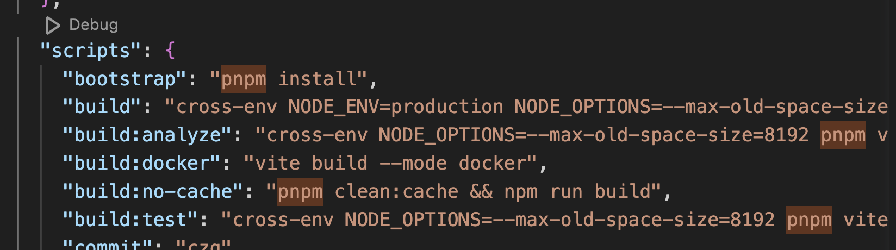
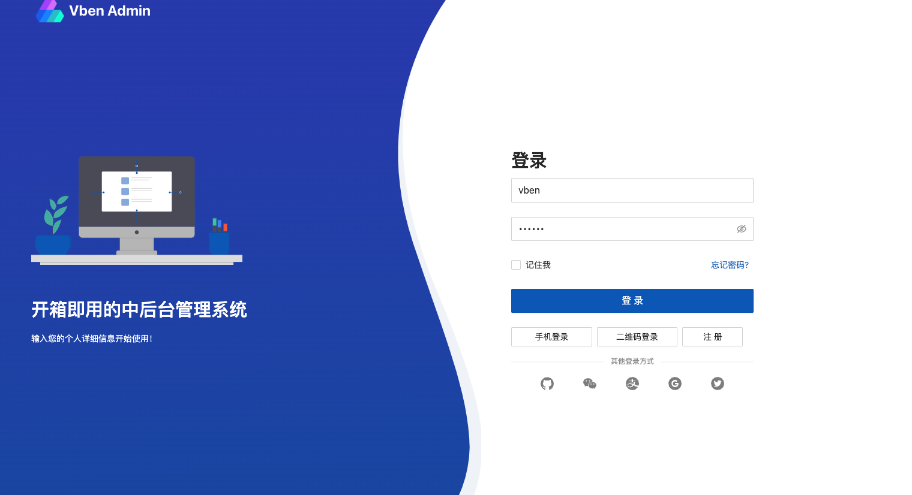

# 项目初识

## 项目介绍

为什么会选择这个项目来学习源码呢？

vue-vben-admin 是一个 vue3 的项目，内容是后台管理。它包含了后台管理几乎所有的模块，在我们工作中出现的模块在这里都能找到。可能工作中会做一些变化，但是底层的一些核心的逻辑都差不多。工作业务无非就是基于自己的项目做一些变化。

从技术栈角度来看，最新版的 vue，ts，ant-design，打包工具用的 vite。基本需要学的主流技术栈都已经涵盖了。

通过学习这个项目，除了介绍这个项目的内容，他涉及到的关联知识点，我会一起介绍，方便大家能够更好的理解他。

大家如果在学习过程中，遇到了任意问题，不太清晰的，都可以问。

这次专栏会分为几大模块介绍

- 项目介绍，服务启动
- 整体项目架构
- 目录结构
- vite 配置介绍
- 其他打包配置作用和功能
- 如何 Mock，联调设置
- 菜单路由
- 权限
- 构建&部署
- 主题切换
- 国际化
- 业务模块/组件学习

#### 项目仓库

[https://github.com/vbenjs/vue-vben-admin](https://github.com/vbenjs/vue-vben-admin)

#### 在线演示地址

[https://vben.vvbin.cn/#/dashboard/analysis](https://vben.vvbin.cn/#/dashboard/analysis)

#### 官方文档地址

[https://doc.vvbin.cn/components/introduction.html)](https://doc.vvbin.cn/components/introduction.html)

在项目开始之前，大家可以将上面的内容先提前熟悉一下。

## 项目初始化

### 下载

```
git clone git@github.com:vbenjs/vue-vben-admin.git
```

### 依赖安装


查看 package.json 的文件看 scripts，全部使用了 pnpm 的命令，所以我得先安装 pnpm。

> 注；要求使用的版本是 >= 8

安装可以看官网：https://pnpm.io/zh/installation

### 运行

```
pnpm dev
```

### 访问

```
http://localhost:5173/
```

浏览器访问 url，可以看到这个页面。


