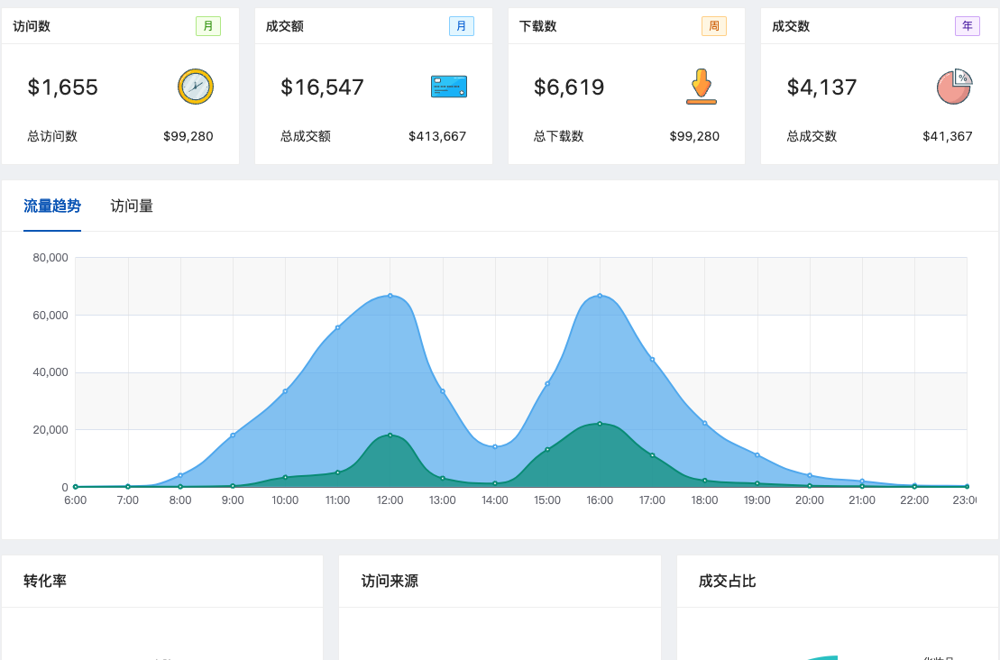

## 布局

![[assets/2.png]]
从整体布局的角度看，分为了三块

1.  左侧菜单
2.  顶部面包屑和右侧的个人中心
3.  内容

## 内容

布局是固定的，内容很多，不过内容大体主要是以下几块组成的。展示的数据不同，但是底层实现方式差不多。
所以我们挑一些代表性的组件学习。

#### 图表

#### 表单

![[]](./assets/4.png)

#### 表格

![[]](./assets/5.png)

#### 流程图

![[]](./assets/6.png)

#### 图片浏览

![[]](./assets/7.png)

#### 详情页数据展示

![[]](./assets/8.png)

#### 报错页面

![[]](./assets/9.png)

#### 配置面板

![[]](./assets/10.png)

#### 列表

![[]](./assets/11.png)

在学习以上的内容，同时我们会看到需要功能，比如菜单下拉，多选/单选，登陆缓存等
