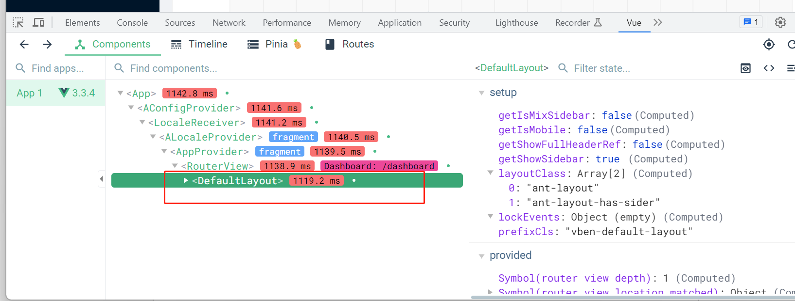
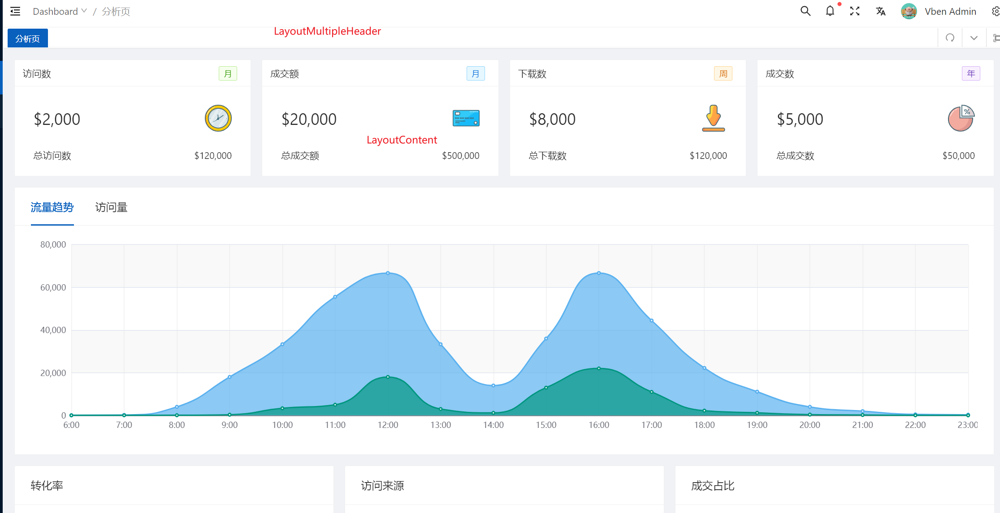

一般 vue 的项目都会从两个文件开始，一个是 matin.ts，还有一个是 App.vue
进入跟路由 App.vue 文件.
不排除有人可能会改文件名称，还有一种方式就是打开根目录的`index.html`我们可以看到他引入的`ts`是`/src/main.ts`，挂载的根目录就是`id=app`

```html
<div id="app"></div>
<script type="module" src="/src/main.ts"></script>
```

在 main.ts 文件里面，通过

```js
const app = createApp(App);
```

可以知道 App.vue 文件就是我们的组件根文件

通过注释`RouterView`，我们刷新页面会得到白板，由此可以确定页面的所有内容从`RouterView`开始。
打开 App.vue 可以看到 RouterView 就是我们所有内容的根目录了，除此之外便没有更多的信息了。

```html
<template>
  <ConfigProvider :locale="getAntdLocale">
    <AppProvider>
      <RouterView />
    </AppProvider>
  </ConfigProvider>
</template>
```

`RouterView`很明显是`router`的关键字，所以我们需要在回到`main.ts`下面去找寻 router 的文件信息，最终可以找到
`src\router\index.ts`

router 的代码很多，暂时无从下手，钻入到细节中有悖我们刚开始看代码的结构，容易看的一头雾水。
所以这个时候，我们要换一个思路了。打开页面，通过 vue-tool 工具，可以看到


进入到目录 `src\layouts\default\index.vue`

```html
<template>
  <Layout :class="prefixCls" v-bind="lockEvents">
    <Layout :class="[layoutClass]">
      <!-- 左侧导航 -->
      <LayoutSideBar v-if="getShowSidebar || getIsMobile" />
      <!-- 右侧内容区域 -->
      <Layout :class="`${prefixCls}-main`">
        <!-- 内容顶部header -->
        <LayoutMultipleHeader />
        <!-- 内容区域 -->
        <LayoutContent />
        <!-- 底部 -->
        <LayoutFooter />
      </Layout>
    </Layout>
  </Layout>
</template>
```

到这里我们已经可以看到页面整体的布局结构关系了，左侧菜单通过 LayoutSideBar，右侧内容通过`Layout`。

到这我们就可以找到整个页面布局的整体大的信息了。



接下来，我们有 2 个疑问
1、左侧的导航路由是怎么来的
2、切换左侧路由，中间的内容区域发生于变化是怎么实现的

还记得我们最开始的路线么，看到 Routerview 就阻塞住了，所以现在摆在我们面前有一个很明显的事情，就是我们需要弄到 router 的内容了。

下篇文章见。
