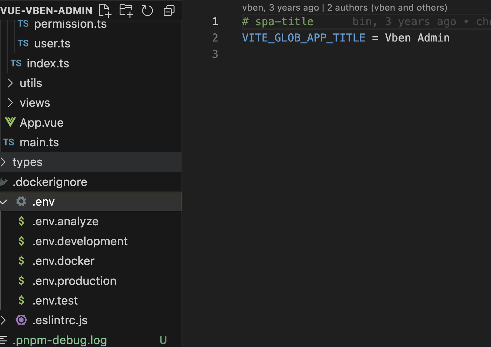

# env 文件的使用

在我们的项目中，可以在目录中发现这么一个文件


他的格式 key = value，这里存储的内容就是我们的环境变量。

在前端开发中，env 文件（也称为环境配置文件）的作用是存储应用程序在不同环境中的配置信息。它通常用于存储与后端服务、数据库连接、第三方 API 密钥等相关的敏感信息。

###### 以下是 env 文件在前端项目中的一些常见用途：

1. 环境区分：env 文件可以根据开发、测试或生产环境来设置不同的配置。通过使用不同的 env 文件，可以在不同的环境中使用不同的配置参数，比如 API 的 URL 地址、数据库连接信息等。

2. 应用配置：env 文件还可以用于存储应用程序的配置信息，例如应用的名称、版本号、主题样式等。这些配置参数可以根据不同的环境进行调整，而无需修改源代码。

3. 第三方服务配置：env 文件可以存储与第三方服务相关的配置，如第三方 API 的密钥、访问令牌、客户端 ID 等。这样可以保护这些敏感信息，避免将其硬编码到源代码中。

4. 调试配置：通过 env 文件，还可以设置一些调试相关的配置参数，如日志级别、调试模式、错误报告等。这样可以在开发和测试环境中方便地进行调试和错误处理。

在实际开发中，通常会使用不同的 env 文件来区分不同的环境，例如`.env.development`、`.env.test`和`.env.production`等。在构建或打包过程中，根据需要选择相应的 env 文件来加载对应的配置。

> 需要注意的是，env 文件中存储的信息通常是敏感的，因此在项目中应该妥善保管这些文件，并且在版本控制系统中忽略它们，以防止敏感信息泄露。

设想一个场景,我们代码中有一段逻辑，在开发环境和生产环境要执行两个个逻辑。

比如：通过注释来将一个代码执行，一个代码不执行，在开发和打包的时候进行注释切换

```js
// buildProd()
buildDev();
```

但是某天打包的时候，忘记将 buidProd 从注释中拿出来了，进行了上线部署，直接造成线上的 bug。

所以我们想通过一种方式能够让我们不要每次打包和开发的时候去人为的改动代码。

这个时候就可以使用 env 了，并且设置 isDev 的变量，然后打包和开发读取两个 env 文件里，业务代码逻辑大概如下

```js
const isDev = env.development;
if (isDev) {
  buildDev();
} else {
  buildProd();
}
```

vben 通过 `import.meta.env` 方法获取变量的值

```js
const projectName = import.meta.env.VITE_GLOB_APP_TITLE;
```

这是通过 vite 的方法拿到，可以看下官网的介绍 https://vitejs.dev/guide/env-and-mode.html

## vite 的 env 使用

Vite 在一个特殊的  **`import.meta.env`**  对象上暴露环境变量。这里有一些在所有情况下都可以使用的内建变量：

- **`import.meta.env.MODE`**: {string} 应用运行的[模式](https://cn.vitejs.dev/guide/env-and-mode.html#modes)。
- **`import.meta.env.BASE_URL`**: {string} 部署应用时的基本 URL。他由[`base`  配置项](https://cn.vitejs.dev/config/shared-options.html#base)决定。
- **`import.meta.env.PROD`**: {boolean} 应用是否运行在生产环境。
- **`import.meta.env.DEV`**: {boolean} 应用是否运行在开发环境 (永远与  `import.meta.env.PROD`相反)。
- **`import.meta.env.SSR`**: {boolean} 应用是否运行在  [server](https://cn.vitejs.dev/guide/ssr.html#conditional-logic)  上。

## env 文件命名

Vite 使用  [dotenv](https://github.com/motdotla/dotenv)  从  [环境目录](https://cn.vitejs.dev/config/shared-options.html#envdir)  中的下列文件加载额外的环境变量：

```bash
.env                # 所有情况下都会加载
.env.local          # 所有情况下都会加载，但会被 git 忽略
.env.[mode]         # 只在指定模式下加载
.env.[mode].local   # 只在指定模式下加载，但会被 git 忽略
```

如果我们要设置一些本地的环境变量，在文件的末尾加上 `local` 就可以了。
